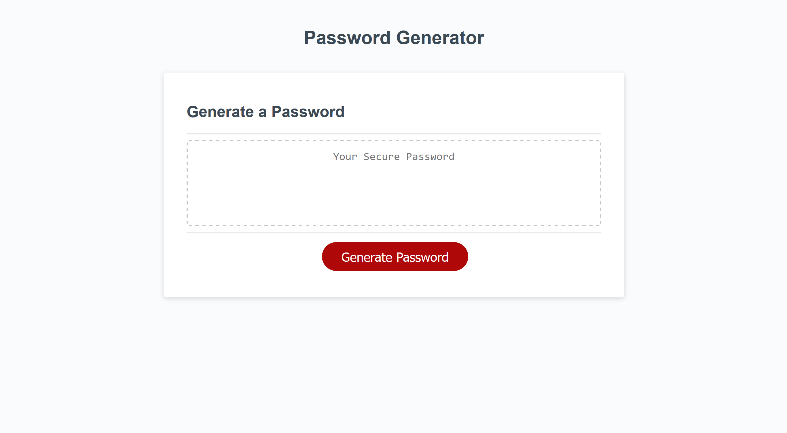

# Password Generator Starter Code

## Description

This code is used to create a password generator webpage for an employee with access to sensitive data. The password generator creates secure, randomly generated passwords based on criteria that is chosen by the user.

## Website Link

https://nataniel-c.github.io/password-generator

## Website Screenshots

---

